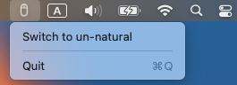

#  Scrollswitcher
A little tool to switch the current scroll direction mode (toggle *Natural* scroll direction on/off). It sits in a status bar, shows the current scroll direction mode, and allows changing the scroll direction by clicking on a popup menu item.
## Screenshots
> Switch to natural scroll mode:

> Switch to "un-natural" mode:

